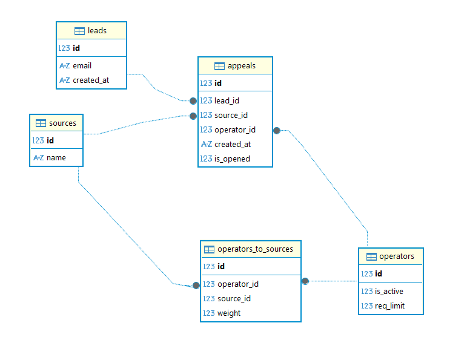

# stack
- FastApi
- Pydantic
- SqlAlchemy
- Alembic
- SQLite

# Холодный запуск
1. `pip install uv`
2. `uv sync`
3. `alembic upgrade head`
4. `python src/main.py`

# Модели
- Appeal - обращения/заявки
- Lead - лиды
- Operator - операторы
- Source - источники
- OperatorsToSources - ассоциативная таблица

# Описание алгоритма распределения
- Лид определяется по email, достается из бд, если существует, иначе создается
- random.choices(operators, weights=weights, k=1)
- Выбираются только те операторы, нагрузка которых меньше лимита для конкретного оператора 
- Выбрасывается исключение, 500, detail="all operators are busy"
